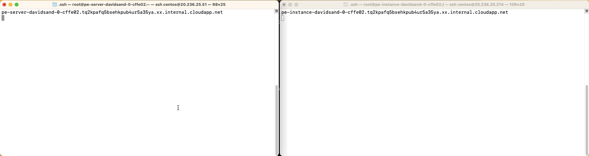
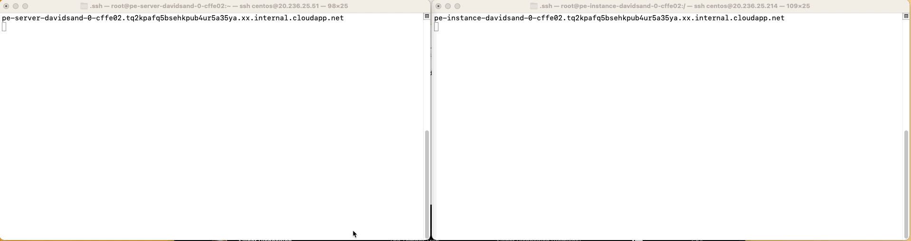
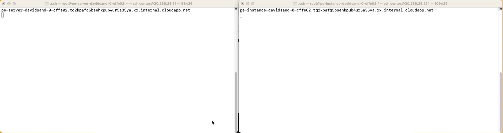

# Puppet Data Service (PDS)

This project is owned by the Puppet Solutions Architects team. It is in an early stage of development and only intended to be used by Puppet Enterprise customers, in close collaboration with its developers.

## Summary

The Puppet Data Service (PDS) provides a centralized API-driven interface for Puppet node data and for Hiera data. PDS supports self-service use cases, and Puppet-as-a-Service (PUPaaS) use cases, providing a foundational mechanism for allowing service customer teams to get work done without requiring manual work to be performed by the PUPaaS team.

The PDS consists of:

1. A database backend. At present PostgreSQL is supported. Backends are plugable, and support for other backends is planned.
2. An API service.
3. A command-line interface (CLI) for human operators.
3. Several Puppet integration components which let Puppet consume data from the API.
4. A Puppet module ([puppetlabs-puppet\_data\_service](https://github.com/puppetlabs/puppetlabs-puppet_data_service)) to aid in setup and configuration.

## Setup

Here is detailed information to install, configure, and run the service using the [puppetlabs-puppet\_data\_service](https://github.com/puppetlabs/puppetlabs-puppet_data_service) module

The `puppet_data_service` module will install the whole PDS [via its RPM](https://github.com/puppetlabs/puppet-data-service/releases) for you, so you don't have to worry about operationalizing the PDS service itself, dealing with DB setup, migrations, and so on, also it will install the PDS CLI as well.

**Required configuration parameters**

* `puppet_data_service::database_host`
* `puppet_data_service::pds_token`

**Optional configuration parameters**

* `puppet_data_service::package_source`

### Quickstart: configure using the PE Console

This setup will help you to quickly configure the PDS in your existing PE server, for advanced Puppet users review the *Configure using roles and Hiera eyaml* section.

1. Add the [puppetlabs-puppet\_data\_service](https://github.com/puppetlabs/puppetlabs-puppet_data_service) module to your control repo
2. Configure the two required application roles
    - The Database server
        - Add a new Node Group from the PE Console.

                Parent name: PE Infrastructure
                Group name: PDS Database
                Environment: production

        - Add the class `puppet_data_service::database` to the PDS Database group created in the step above
        - Add your existing PE PostgreSQL server to the group using the Rules tab (it could be the primary server)
            - In case you want to test the PDS in a different server without PostgreSQL, you can apply the `puppet_enterprise::profile::database` class to your node before following these steps
        - Commit your changes
    - PDS API servers
        - In the **PE Master** node group
            - In the classes tab
                - Add the new class `puppet_data_service::server`
                - Include at least the following parameters:
                    - database_host: The resolvable address (fqdn) of the PDS database host.
            - In the Configuration data tab:
                -  Configure the _sensitive_ `pds_token` parameter. You may generate and pass a UUID to initialize the "admin" account token in a new PDS system. If the PDS is already deployed, you must supply a valid PDS user token.
            - Commit your changes
3. Run the Puppet Agent

### Robust: configure using roles and Hiera eyaml

If you are an experienced Puppet practicioner, this other configuration option will give you the tools you need to make your own Puppet profiles.

Include the profile classes in the appropriate role class, if roles are being used.

We suggest that each compiler run an instance of the PDS API server.

**The PDS Database server**

Example profile
```puppet
# control-repo/site-modules/profile/manifests/pds_database_server.pp

class profile::pds_database_server {
  include puppet_data_service::database
}
```

**The PDS API server**

Example profile
```puppet
# control-repo/site-modules/profile/manifests/pds_api_server.pp

class profile::pds_api_server {
  include puppet_data_service::server
  # Set at least these parameter values in Hiera:
  #   ---
  #   puppet_data_service::server::database_host: 'database.example.com'
  #   puppet_data_service::server::pds_token: 'C979C2A2-C031-4B7B-B271-08DFBD6C795D'
}
```

Since the `pds_token` is a sensitive parameter, it should ideally be encrypted using [Hiera eyaml](https://github.com/voxpupuli/hiera-eyaml).

## Configure Hiera backend

To use the Hiera data elements of PDS, your hiera.yaml must include a level for the Puppet Data Service. Instructions for configuring the hiera backend in your hiera.yaml are available [here](https://github.com/puppetlabs/puppetlabs-puppet_data_service#hiera-backend).

## Development

The PDS [app](app/) folder contains detailed instructions to run the PDS API in a local development environment, as well as the CLI [golang](golang/) README file explains how to build and test the PDS CLI.

### Building the pds-server package

The following paths are included in the packaging of pds-server.

```
Paths:
  /opt/puppetlabs/server/apps/pds-server
    - Server application files

  /etc/puppetlabs/pds
    - Config files

  /opt/puppetlabs/bin
    - pds-cli executable

  /opt/puppetlabs/sbin
    - pds-ctl admin utility script

  /etc/puppetlabs/puppet/trusted-external-commands/pds
    - Wrapper to `pds-cli node get --trusted-external-command "$1"`
```

#### Packaging dependencies

* `fpm` must be installed
* `rpm` build tools must be installed
* `deb` build-essentialmust be installed

#### Procedure

To build the pds-server RPM package

1. Checkout the project repo on a host of the OS type you would like to build the package for and change to that directory
2. Run `make clean`
3. Run `make rpm`

To build the pds-server DEB package

1. Checkout the project repo on a host of the OS type you would like to build the package for and change to that directory
2. Run `make clean`
3. Run `make deb`


## User guide

As a PDS user you currently have two options to interact with it.

1. PDS CLI
2. PDS API

This user guide will focus on the PDS CLI, but if you want to create your own PDS client (e.g. web app) check the [PDS API documentation](docs/)

The CLI offers you a convinient way to create and retrieve data from the PDS. You can interact with it by typing in your Puppet Server's terminal:

```
pds-cli
```
[The PDS CLI documentation](golang/pds-cli/doc/pds-cli.md) section has detailed instructions of the available options
## PDS cli demo

Demonstrating the PDS CLI capabilities with the below GIFs

1. Adding a class to a instance

Steps
* Check the content of site.pp and hiera.yaml to allow for class and configuration on the server
* Check the content of the client catalog on the client
* Add the motd class to the client node with the pds-cli on the server
* Running the puppet agent on the client node and confirm the new class is in the catalog and applied.



2. Adding hiera data to a node

Steps
* Add a hiera value for the client node for motd content 
* Run puppet on the client and confirm the new content is pplied



3. Adding a fact and using it in hiera data

Steps
* Add a fact to the client node with the pds-cli
* Run puppet on the client to pick up the new fact
* API call to show external facts on the server
* Update the hiera content with the pds-cli to change motd content and include the fact
* Run puppet on the client to apply the change to motd



## Disaster Recovery

All Puppet Data Service (PDS) implementations have a Backend Storage Service (BSS) which is either a source of truth or a cached version of an external source of truth to facilitate better integration with Puppet. In both scenarios you must plan for regular backups of the BSS to reduce RTO and prevent data loss. Backup and restore operations should be initiated through the PDS API. The PDS API can bulk output and load JSON via flat files, making the backup and restore procedure independent from the technology chosen to implement BSS durable storage.

### Recovery Time Objective

RTO of a PDS deployment is dependent in large upon the BSS implementation. The actual API service is fairly simple and deploys quickly, data stored in the BSS is not complex, primarily made up of key/value pairs and lacking of any relationships.

This PDS implementation has the Puppet Enterprise customer as the primary user in mind and in that context the BSS is backed by PE PostgreSQL so a loss of the PDS BSS likely coincides with a loss of PE services. To restore PDS services PE must be online so the RTO is calculated as `RTO of PE + PDS API deployment time + BSS data restore time`. In a scenario where the user has a Large architecture deployment of PE, a **2 hour** RTO is reasonable but Recovery Time Actual (RTA) will flux dependent upon the time it takes to restore PE services and the quantity of data that was stored in the BSS.

Scenarios where the PDS is not dependent on the functionality of PE can usually be recovered in less time. This is simply because obtaining a database from PE after a disaster requires you restore the entirety of PE; if PE is not a factor then an independent database can be provisioned to house restored BSS data. The time to online a non-PE dependent PDS service is at least half of the time it takes to online a PE dependent installation. In most scenarios a **1 hour** RTO is reasonable. This is calculated by taking `BSS backend database deployment time + PDS API deployment time + BSS data restore time`.

### Recovery Point Objective

RPO of a PDS deployment is dependent on rate of change of user modifications and how you address that rate of change with your backup schedule. The RPO is calculated by `Timestamp of service loss - Timestamp of last backup`. This number will be the number of hours of data loss that you will need to be re-input manually or obtain from an external source of truth.

How feasible restoring incremental lost data depends on rate of change. If you only see a few changes a day then daily backups will be sufficient but if your change rate is dozens per hour then a more frequent backup schedule is ideal. Having to manually input data not found in your latest backup through the PDS API could be time consuming, affecting your Recovery Time Actual (RTA).

### Backup and Restore Procedure

The basic procedure for backing up the PDS is running the `pds-cli` list sub-command against each endpoint, once for user, hiera, and node to output all values as a single JSON blob then transforming that data to be an appropriate data structure for doing a mass add through the `pds-cli` create endpoint at a later date. For the data dumped from a list to be valid for restoration it needs to be contained in a JSON hash key of `resources`.

**Example CLI output:**
```
[
    {
      "level": "common",
      "key": "pds::nothing",
      "value": null,
      "created-at": "2022-01-25T22:27:42.761Z",
      "updated-at": "2022-01-25T22:27:42.761Z"
    },
    {
      "level": "common",
      "key": "pds::color",
      "value": "red",
      "created-at": "2022-01-25T22:27:42.762Z",
      "updated-at": "2022-01-25T22:27:42.762Z"
    },
    {
      "level": "priority",
      "key": "pds::color",
      "value": "blue",
      "created-at": "2022-01-25T22:27:42.764Z",
      "updated-at": "2022-01-25T22:27:42.764Z"
    }
]
```

**Valid structure for CLI restore:**

```
{
  "resources": [
    {
      "level": "common",
      "key": "pds::nothing",
      "value": null,
      "created-at": "2022-01-25T22:27:42.761Z",
      "updated-at": "2022-01-25T22:27:42.761Z"
    },
    {
      "level": "common",
      "key": "pds::color",
      "value": "red",
      "created-at": "2022-01-25T22:27:42.762Z",
      "updated-at": "2022-01-25T22:27:42.762Z"
    },
    {
      "level": "priority",
      "key": "pds::color",
      "value": "blue",
      "created-at": "2022-01-25T22:27:42.764Z",
      "updated-at": "2022-01-25T22:27:42.764Z"
    }
  ]
}
```

An example workflow on how you can validate backup and restore functionality can be found [here](docs/backup_restore.md) is the docs folder.
